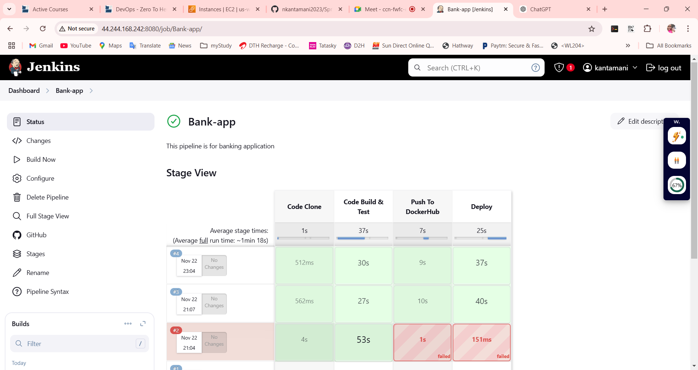
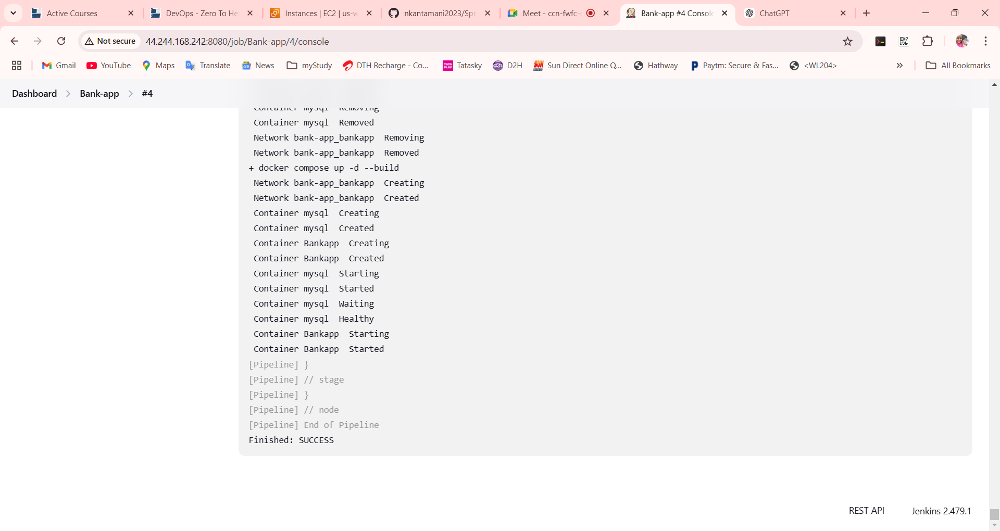

# 🚀 Multi-Tier Bank Application Deployment  
This repository contains an **End-to-End Multi-Tier Bank Application** built using **Java (Spring Boot)**. The application is containerized, enabling seamless deployment on AWS EC2 instances using tools like **Docker**, **Docker Compose**, **Jenkins**, and more.  

---

## 📌 Project Highlights  

- **Technology Stack**: Java, Spring Boot, MySQL, Docker, Jenkins, AWS  
- **Deployment Options**:  
  - Docker Networking  
  - Docker Compose  
  - Jenkins-based CI/CD   
    
  
  

---

## 🛠 Pre-requisites  

Ensure you have the following:  
- **AWS Account**  
- **Ubuntu EC2 Instance** (Recommended: `t2.medium`)  
- **Installed Tools**:  
  - Docker 
## 🏗 Deployment Steps  

### **<p id="docker-networking">Deployment Using EC2 Instance</p>**  

#### SSH into Your EC2 instance

```bash
ssh -i "your pem- key" ubuntu@ec2-44-244-168-242.us-west
```

Create a new Directory: 
```bash
mkdir dir_name
```
Go into `cd dir_name`

#### Clone the Repository  
```bash  
git clone -b DevOps https://github.com/nkantamani2023/Springboot-BankApp.git 
``` 
```bash
cd Springboot-BankApp  
```
Install Docker
```bash
sudo apt update -y
```
```bash  
sudo apt install docker.io && docker-compose-v2 -y
```
```bash  
sudo usermod -aG docker $USER && newgrp docker
```

Build the Docker Image
```bash
docker build -t bankapp .  
```
Create Docker Network 
```bash
docker network create bankapp
```    
Run MySQL Container
```bash
docker run -itd --name mysql \  
  -e MYSQL_ROOT_PASSWORD=Test@123 \  
  -e MYSQL_DATABASE=BankDB \  
  --network=bankapp mysql  
  ```
Run Application Container
```bash
docker run -itd --name BankApp \  
  -e SPRING_DATASOURCE_USERNAME="root" \  
  -e SPRING_DATASOURCE_URL="jdbc:mysql://mysql:3306/BankDB?useSSL=false&allowPublicKeyRetrieval=true&serverTimezone=UTC" \  
  -e SPRING_DATASOURCE_PASSWORD="Test@123" \  
  --network=bankapp \  
  -p 8080:8080 bankapp  
  ```
Access the Application
Open Port 8080 of your AWS EC2 instance.
Navigate to: http://<public-ip>:8080
🎉 Congratulations! Your application is live.

🌐 Future Enhancements
CI/CD pipeline with Jenkins (Guide).

 
 Step 1: Go to the AWS EC2 instance and copy your master-node public ip address and paste it in the browser address-bar with port `8080` . 

  Step 2: Go to AWS your master-node instaces and select security groups and go to add rule `8080` save this.

Step 3: Configure your pipeline.

```groovy
pipeline{
    agent { label 'agent-slave' }
    
    stages{
        stage("Code Clone"){
            steps{
                echo "Code Clone Stage"
                git url: "https://github.com/nkantamani2023/Springboot-BankApp.git", branch: "DevOps"
            }
        }
        stage("Code Build & Test"){
            steps{
                echo "Code Build Stage"
                sh "docker build -t bankapp ."
            }
        }
        stage("Push To DockerHub"){
            steps{
                withCredentials([usernamePassword(
                    credentialsId:"dockerhub-creds",
                    usernameVariable:"dockerHubUser", 
                    passwordVariable:"dockerHubPass")]){
                sh 'echo $dockerHubPass | docker login -u $dockerHubUser --password-stdin'
                sh "docker image tag bankapp:latest ${env.dockerHubUser}/bankapp:latest"
                sh "docker push ${env.dockerHubUser}/bankapp:latest"
                }
            }
        }
        stage("Deploy"){
            steps{
                sh "docker compose down && docker compose up -d --build"
            }
        }
    }
}
```

Step 4: Navigate to bank app dashboard and click on `Build Now` button.

Step 5: Your Pipeline has been created

👨‍💻 Author: Kantamani
