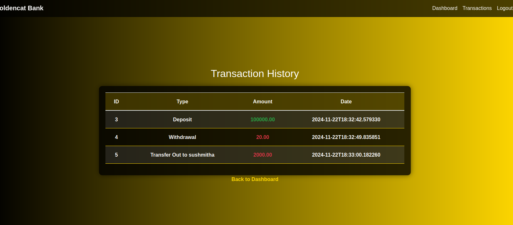
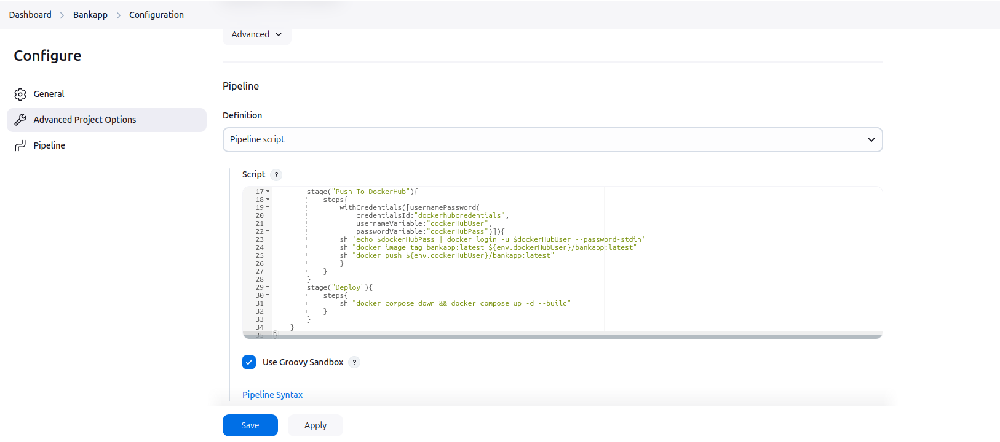
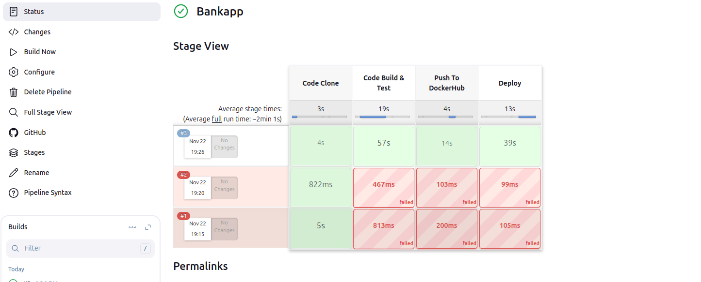
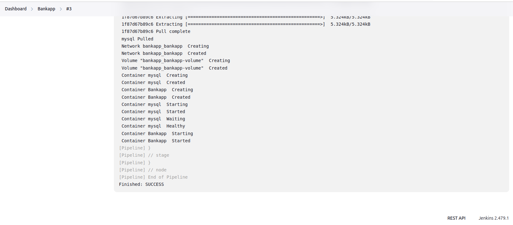

# 🚀 Bank Application Project 
The bank application project involves setting up jenkins pipeline on AWS EC2 using docker.
This pipeline is used to build,test and deploy bank application.

---

 

---

**Project Features**
-------------------

* Jenkins pipeline for building, testing, and deploying a software project
* Dockerized Jenkins instance on an AWS EC2 instance
* EC2 instance as a master node and EC2 instance as a worker node
* Dockerfile for building the project image
* Jenkinsfile for configuring the Jenkins pipeline

**Pre-requisites**
-----------------

Ensure you have the following:
*AWS Account** with EC2 instances (Ubuntu 20.04 or later)
*Ubuntu EC2 Instance** (Recommended: `t2.medium`)
*Docker** installed on the EC2 instances
*Basic knowledge** of Docker, Jenkins, and AWS

**Step-by-Step Guide**
----------------------

### Step 1: Set up the Master Node (EC2 Instance)

1. Launch an EC2 instance (Ubuntu 20.04 or later) and connect to it using SSH.
2. Install Docker on the instance: `sudo apt update && sudo apt install docker.io`
3. Start the Docker service: `sudo systemctl start docker`
4. Enable the Docker service to start at boot: `sudo systemctl enable docker`

### Step 2: Set up the Worker Node (EC2 Instance)

1. Launch another EC2 instance (Ubuntu 20.04 or later) and connect to it using SSH.
2. Install Docker on the instance: `sudo apt update && sudo apt install docker.io`
3. Start the Docker service: `sudo systemctl start docker`
4. Enable the Docker service to start at boot: `sudo systemctl enable docker`

### Step 3: Configure the Master Node as a Jenkins Server

1. Install Jenkins on the master node: `sudo apt update && sudo apt install jenkins`
2. Start the Jenkins service: `sudo systemctl start jenkins`
3. Enable the Jenkins service to start at boot: `sudo systemctl enable jenkins`
4. Configure Jenkins to use the Docker daemon: `sudo tee /etc/jenkins/jenkins.yaml <<EOF`
```yaml
jenkins:
  agent:
    docker:
      enabled: true
```
### Step 4: Configure the Worker Node as a Jenkins Agent

1. Install the Jenkins agent on the worker node: `sudo apt update && sudo apt install jenkins-agent`
2. Configure the Jenkins agent to connect to the master node: `sudo tee /etc/jenkins/agent.yaml <<EOF`
```yaml
jenkins:
  agent:
    master:
      url: http://<master-node-ip>:8080
```
### Step 5: Create a Dockerfile for the Project

1. Create a new file named `Dockerfile` in the project directory:
```dockerfile
FROM ubuntu:20.04

# Install dependencies
RUN apt update && apt install -y build-essential

# Copy the project code
COPY . /app

# Build the project
RUN make build

# Expose the port
EXPOSE 8080

# Run the command
CMD ["make", "run"]
```
### Step 6: Create a Jenkinsfile for the Project

1. Create a new file named `Jenkinsfile` in the project directory:
```groovy
pipeline {
    agent any

    stages {
        stage('Build') {
            steps {
                sh 'make build'
            }
        }
        stage('Test') {
            steps {
                sh 'make test'
            }
        }
        stage('Deploy') {
            steps {
                sh 'make deploy'
            }
        }
    }
}
```
### Step 7: Build the Project Image using Docker

1. Navigate to the project directory and run the command: `docker build -t my-project .`

### Step 8: Configure Jenkins to Build the Project

1. Log in to the Jenkins web interface and create a new pipeline job.
2. Configure the job to use the `Jenkinsfile` and build the project image using Docker.

### Step 9: Establish the Connection between the Master Node and Worker Node

1. Configure the Jenkins master node to connect to the worker node: `sudo tee /etc/jenkins/jenkins.yaml
```yaml
jenkins:
  agent:
    docker:
      enabled: true
    worker:
      url: http://<worker-node-ip>:8080
```
2. Restart the Jenkins service on the master node: `sudo systemctl restart jenkins`

##### That's it! You have now set up a Jenkins pipeline on an AWS EC2 instance using Docker, with a master node and worker node. You can use this pipeline to build, test, and deploy your software project.

---
 
## 🏗 Deployment Steps  

### **<p id="docker-networking">Deployment Using EC2 Instance</p>**  

#### Step 1: Set up the Master Node (EC2 Instance)
**Go to AWS your master-node instances and select security groups and go to add rule `8080` save this.**
**Configure EC2 Security Group:**
+1. Navigate to your EC2 instance's security group
+2. Add inbound rule:
+   - Port: 8080
+   - Protocol: TCP
+   - Source: Custom (Recommended: Your IP) or 0.0.0.0/0 (Not recommended for production)
+3. Save the changes
```bash
ssh -i "your pem- key" ubuntu@ec2-44-244-168-242.us-west
```
Install [Docker](https://docs.docker.com/engine/install/ubuntu/), [java](https://www.jenkins.io/doc/book/installing/linux/), [Jenkins](https://www.jenkins.io/doc/book/installing/linux/)
```bash
sudo apt update -y
```
```bash  
sudo apt install docker.io -y
sudo apt install docker-compose-v2
```
```bash
sudo apt update
sudo apt install fontconfig openjdk-17-jre
java -version
```
```bash
sudo wget -O /usr/share/keyrings/jenkins-keyring.asc \
  https://pkg.jenkins.io/debian-stable/jenkins.io-2023.key
echo "deb [signed-by=/usr/share/keyrings/jenkins-keyring.asc]" \
  https://pkg.jenkins.io/debian-stable binary/ | sudo tee \
  /etc/apt/sources.list.d/jenkins.list > /dev/null
sudo apt-get update
sudo apt-get install jenkins
```
```bash  
sudo usermod -aG docker $USER && newgrp docker
```
```bash
sudo usermod -aG jenkins docker
```
Access <Your_Instance_Public_IP>:8080
  * To Access your jenkins server.

---

  


🎉 Congratulations! Your Jenkins Server is live.

#### Step 2: Set up the Worker Node (EC2 Instance)
**Go to AWS your master-node instaces and select security groups and go to add rule `8080` save this.**
```bash
ssh -i "your pem- key" ubuntu@ec2-44-244-168-242.us-west
```
Install [Docker](https://docs.docker.com/engine/install/ubuntu/), [java](https://www.jenkins.io/doc/book/installing/linux/)
```bash
sudo apt update -y
```
```bash  
sudo apt install docker.io && docker-compose-v2 -y
```
```bash
sudo apt update
sudo apt install fontconfig openjdk-17-jre
java -version
```
 
Step 1: Go to the AWS EC2 instance and copy your worker-node public ip address and paste it in the jenkins Agent config windows. 
Craete a Directory in your `workernode.`
```bash
mkdir workernode
```
Copy the Present Working Directory and paste it in the Agent config window.
``bash
pwd
```
Step 2: 

Step 3: Configure your pipeline.

```groovy
pipeline{
    agent { label 'workernode' }
    
    stages{
        stage("Code Clone"){
            steps{
                echo "Code Clone Stage"
                git url: "https://github.com/sushmithavs/Springboot-BankApp.git", branch: "DevOps"
            }
        }
        stage("Code Build & Test"){
            steps{
                echo "Code Build Stage"
                sh "docker build -t bankapp ."
            }
        }
        stage("Push To DockerHub"){
            steps{
                withCredentials([usernamePassword(
                    credentialsId:"dockerhub-creds",
                    usernameVariable:"dockerHubUser", 
                    passwordVariable:"dockerHubPass")]){
                sh 'echo $dockerHubPass | docker login -u $dockerHubUser --password-stdin'
                sh "docker image tag bankapp:latest ${env.dockerHubUser}/bankapp:latest"
                sh "docker push ${env.dockerHubUser}/bankapp:latest"
                }
            }
        }
        stage("Deploy"){
            steps{
                sh "docker compose down && docker compose up -d --build"
            }
        }
    }
}
```

Step 4: Navigate to bank app dashboard and click on `Build Now` button.

Step 5: Your Pipeline has been created



🎉 Congratulations! Your bankapp is running on workernode port `8080.`

👨‍💻 Author: Sushmitha

